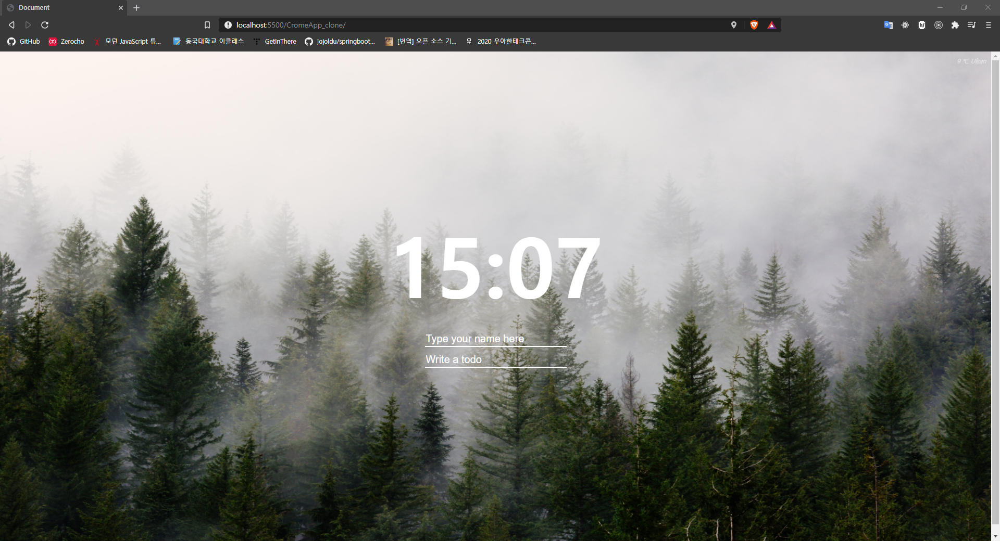
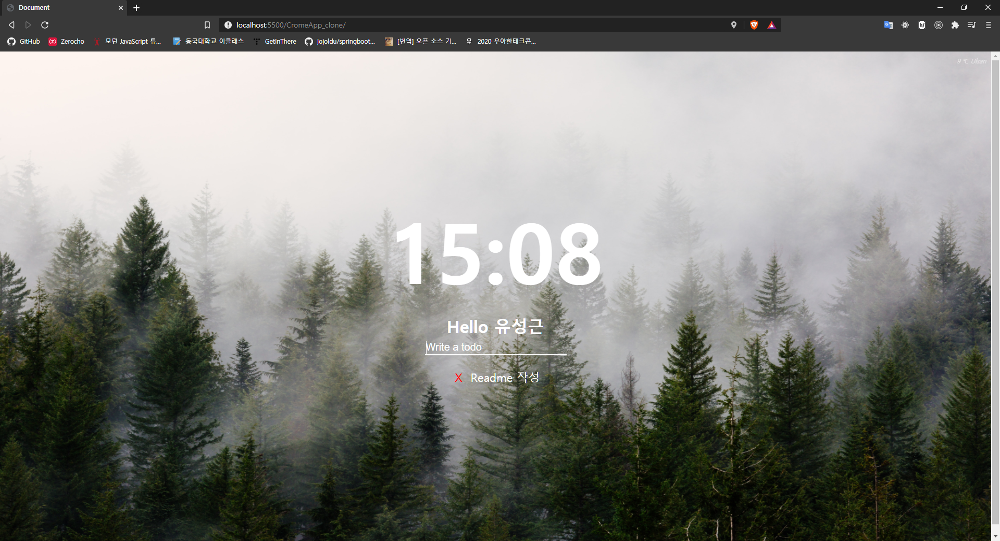

# HTML, CSS 클론 코딩

## 개요

- 유명 웹사이트를 비슷하게 따라만드는 클론 코딩
- HTML, CSS에 기초적인 vanilla javascript를 사용해 interactive한 기능을 추가

## 프로젝트 소개

## 1. 크롬 앱

- 노마드코더 바닐라 JS로 크롬 앱 만들기 : https://nomadcoders.co/javascript-for-beginners
- javascript를 사용해 실시간 시간 표시
- 이름을 작성하면 localStorage에 사용자 이름을 저장
- Todo를 작성하면 역시 localStoage에 저장
- Todo 삭제 기능
- 날씨 api를 사용해 날씨 및 기온 출력
- 저장된 이미지 중 랜덤한 이미지를 background이미지로 설정

### 구현 화면

1. 메인 화면
   
1. 이름과 TODO 작성 화면
   
