# HTML, CSS 클론 코딩

## 개요

- 유명 웹사이트를 비슷하게 따라 만드는 클론 코딩
- HTML, CSS에 기초적인 vanilla javascript를 사용해 interactive한 기능을 추가

## 프로젝트 소개

## 1. 유튜브 클론

- 드림코딩 by 엘리 유튜브 사이트 따라 만들기 강좌 : https://www.youtube.com/watch?v=67stn7Pu7s4
- HTML과 CSS를 사용해서 매우 기초적인 유튜브 페이지를 클론 코딩
- video 태그를 사용해서 비디오 재생
- HTML 태그의 classList에서 특정 class를 토글하는 방식을 javascript로 구현하여 아주 기초적인 사용자 상호작용 구현

### 구현 화면

1. 메인 화면
   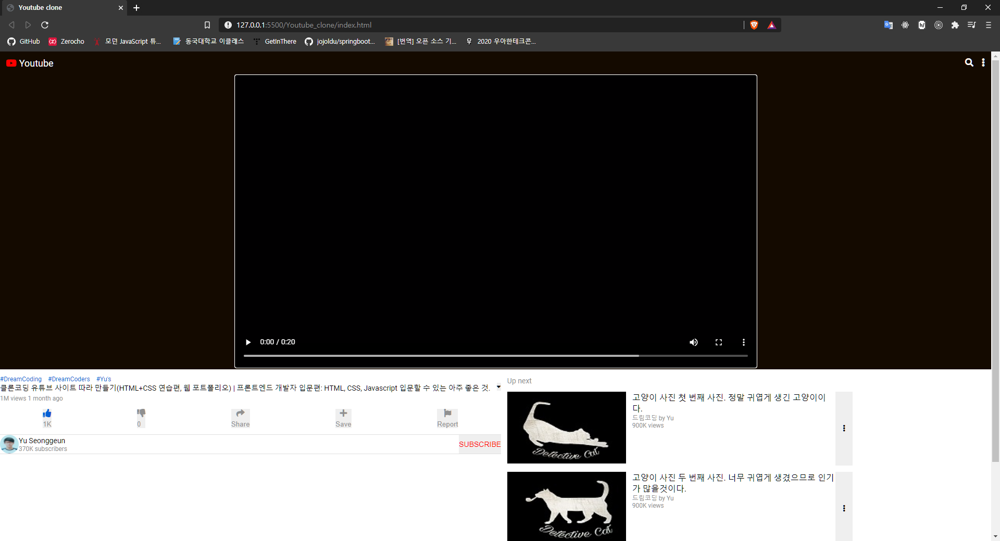

## 2. 네이버 클론

- 제로초(zerocho) HTML/CSS 강좌 : https://www.youtube.com/playlist?list=PLcqDmjxt30Rsb8Zpgbemt-NaCOjr2WIUj
- HTML과 CSS만을 사용해서 네이버 메인 페이지를 클론 코딩
- iframe을 사용해 외부 페이지의 일부를 표시

### 구현 화면

1. 메인 화면
   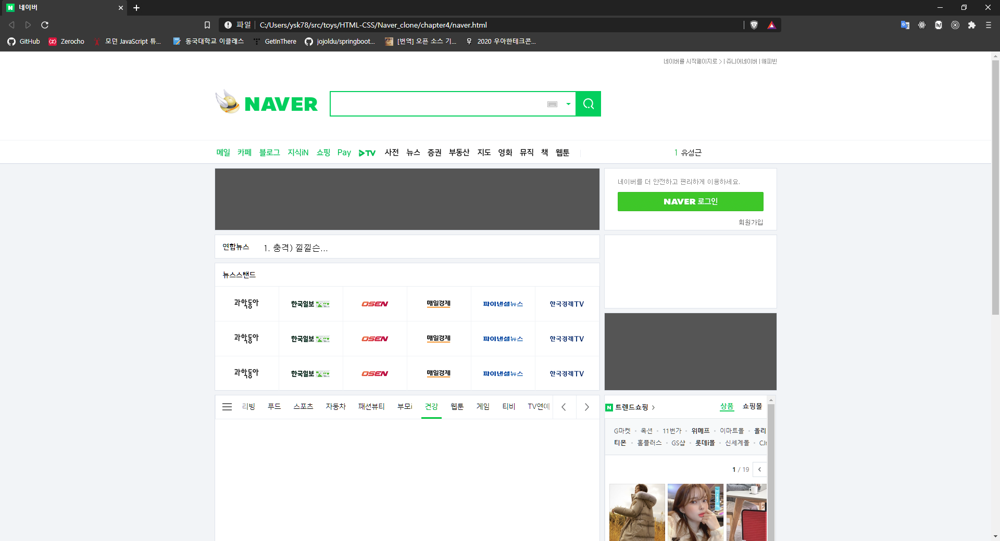

## 3. 크롬 앱

- 노마드코더 바닐라 JS로 크롬 앱 만들기 : https://nomadcoders.co/javascript-for-beginners
- javascript를 사용해 실시간 시간 표시
- 이름을 작성하면 localStorage에 사용자 이름을 저장
- Todo를 작성하면 역시 localStoage에 저장
- Todo 삭제 기능
- 날씨 api를 사용해 날씨 및 기온 출력
- 저장된 이미지 중 랜덤한 이미지를 background이미지로 설정

### 구현 화면

1. 메인 화면
   
2. 이름과 TODO 작성 화면
   

## 4. Paintjs

- 노마드코더 바닐라 JS로 그림판 만들기 : https://nomadcoders.co/javascript-for-beginners-2
- HTML canvas 태그를 사용하여 그림판을 구현
- 연필을 이용해 자유롭게 그림 그리기
- fill 버튼을 통해 색 채우기
- 색 선택, 연필 굵기 조절 가능
- save 버튼을 통해 실제 이미지 파일로 저장

### 구현 화면

1. 메인 화면
   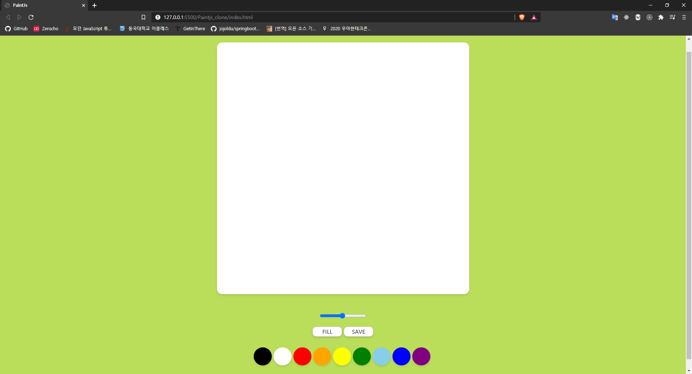
2. 색과 굵기를 다르게 하여 연필로 그리기
   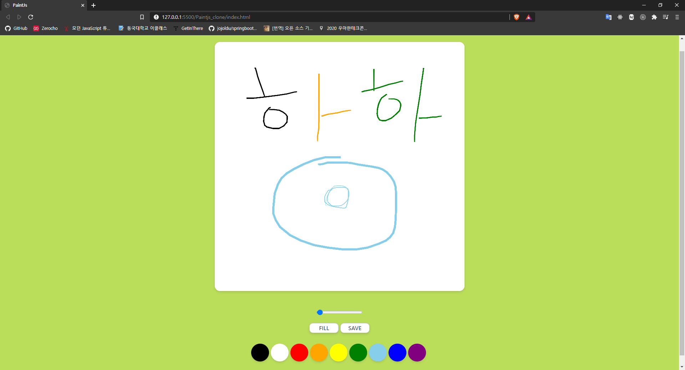
3. fill 버튼으로 채우기
   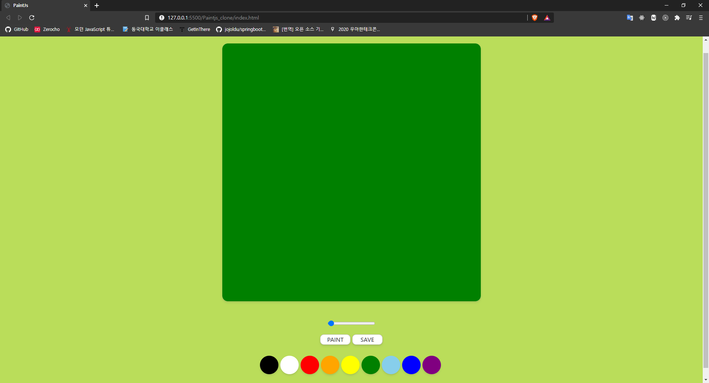
4. save 버튼으로 저장하기
   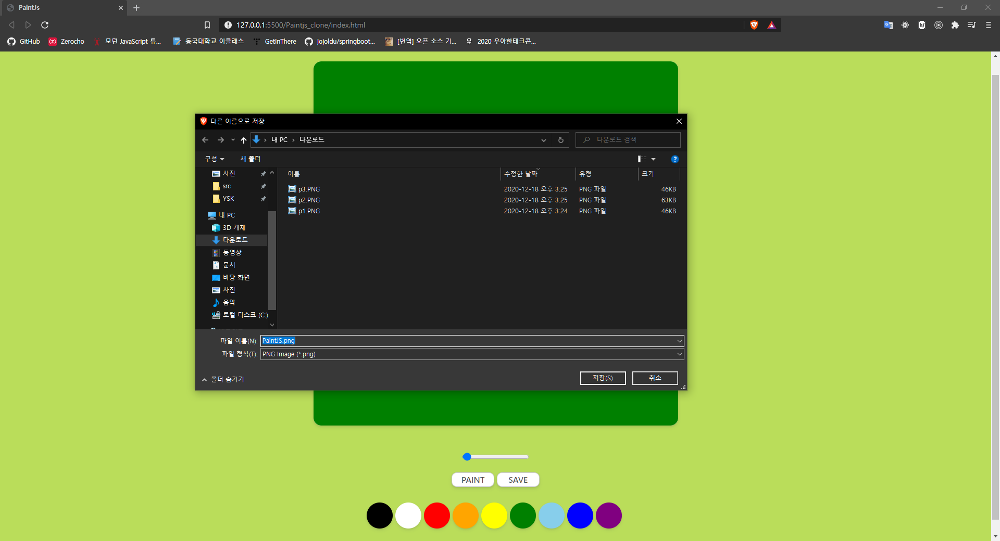

## 5. 깃허브 클론

- 강의 도움 없이 처음으로 스스로 해본 클론 코딩
- CSS Flex를 주로 사용
- 미디어 쿼리를 사용하여 반응형으로 제작
- javascript를 사용하여 약간의 사용자 상호작용 추가

### 구현 화면

1. 메인 화면
   
2. javascript와 css를 활용한 검색기록 표시
   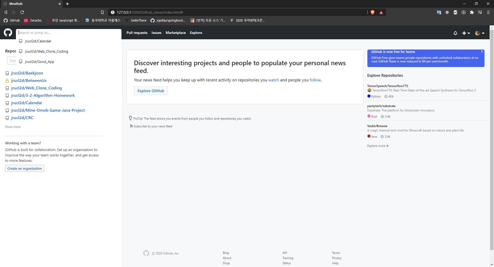
3. 반응형 웹 디자인
   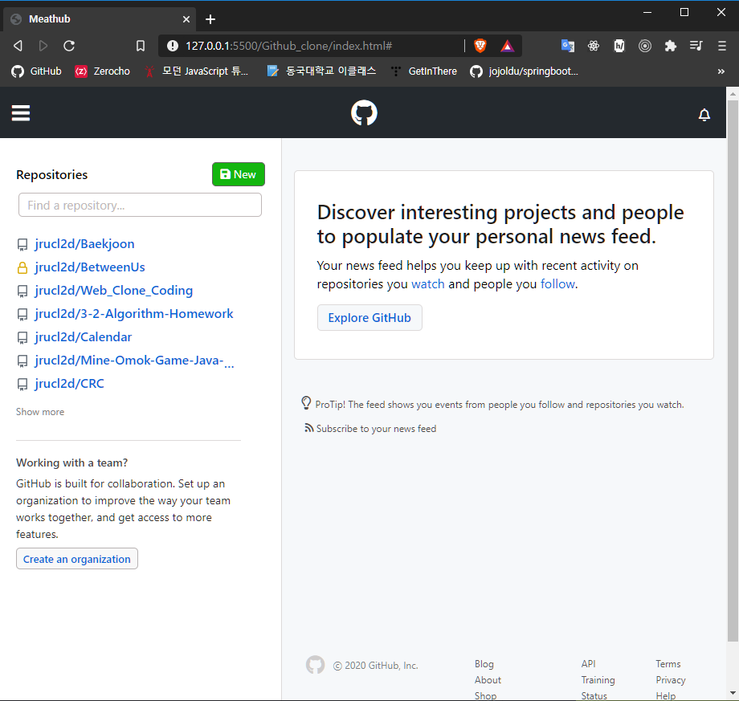
   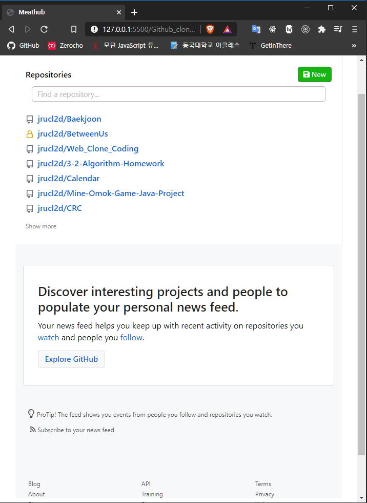

## 6. 넷플릭스 클론

- 강의 도움 없이 스스로 만든 두 번째 클론 코딩
- CSS Flex를 주로 사용
- accordian menu 구현

### 구현 화면

1. Header
   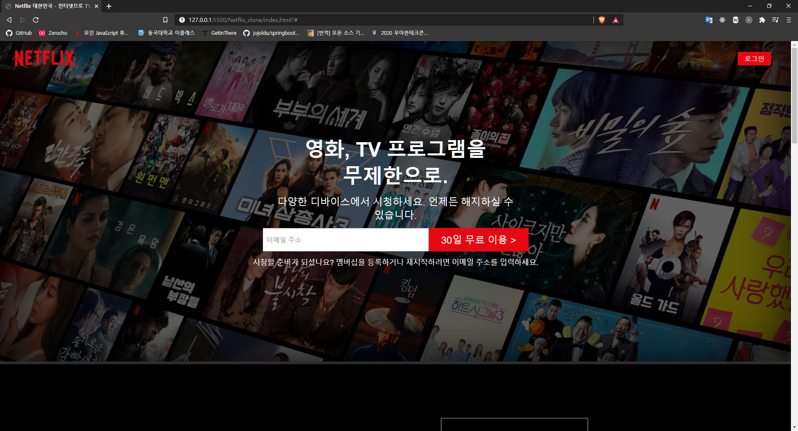
2. 페이지 중단
   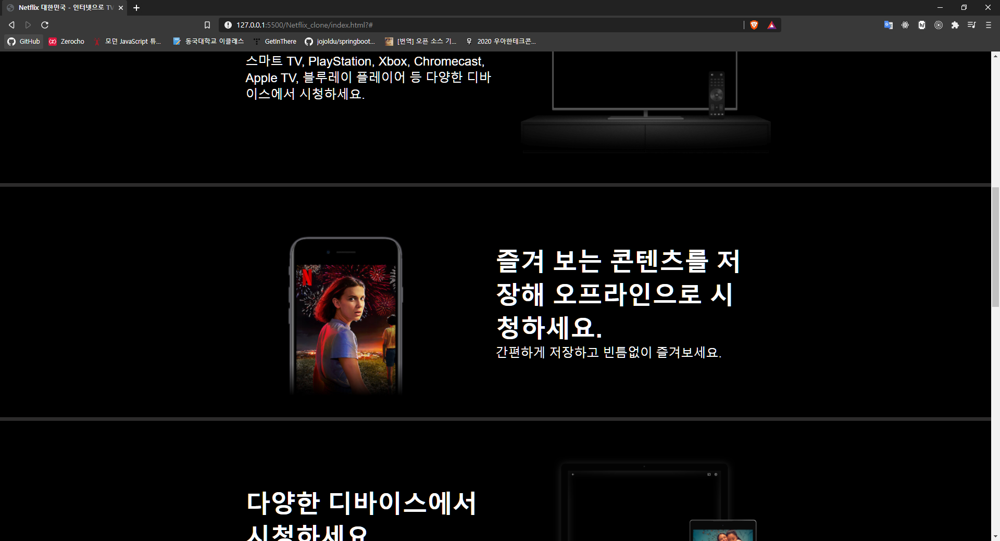
3. 페이지 하단
   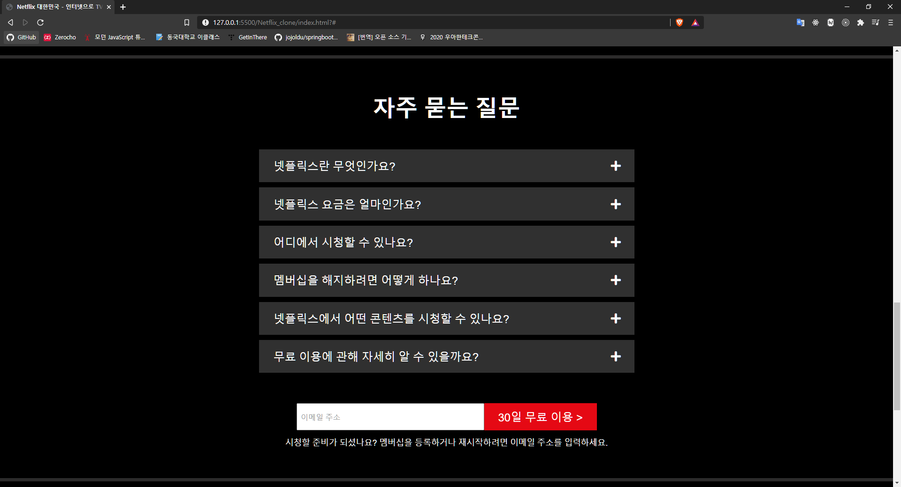
4. Footer
   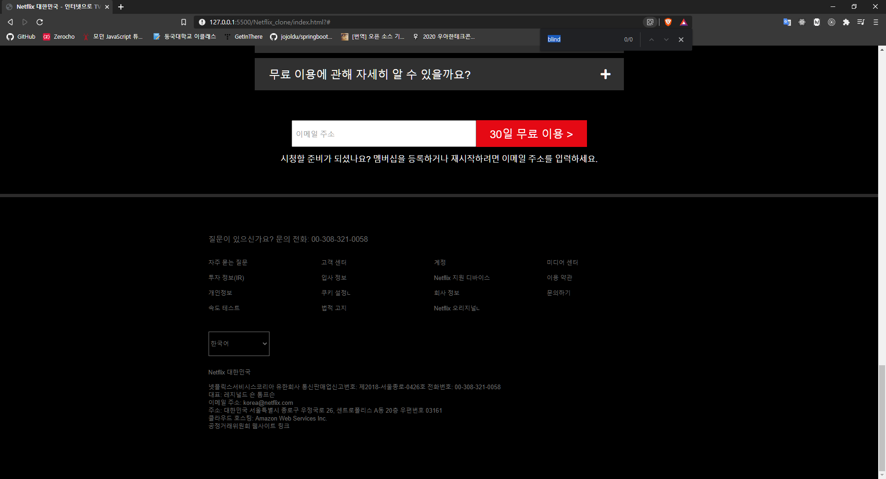
5. accordian menu
   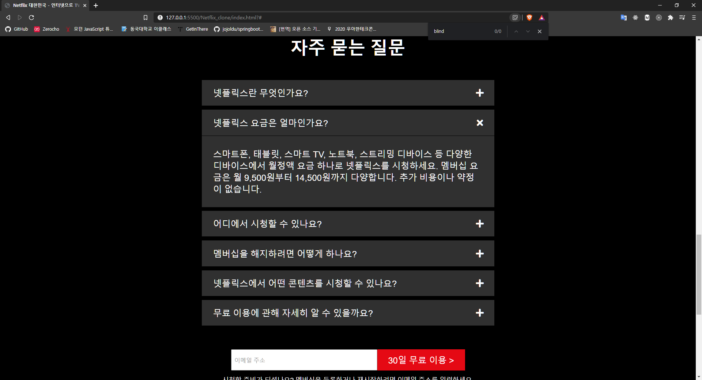
